# Player Guide
Mobile Wizard is a web based 2-player street fighter like game that utilizes mobile browsers as player controllers.
Each game requires a device as game host and two mobile devices as wand.

## Create Game Room
Players need to have use a device as game host, where players can create game rooms. Players can go to
[our website](https://game.projectmobilewizard.com) using a browser (Chrome is recommended) and create a room with any name.

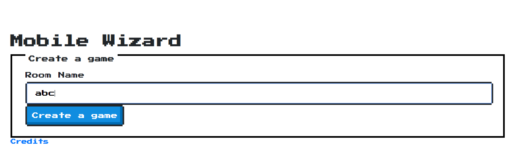

If using a computer as host, players will directly see above page. While if using a mobile as host, players can go to above page by clicking the blue "Create room" link in login page (as shown in "Player Join Room" section). 
 
After room created, players will see the room lobby as following. The Room ID and QR code are identifiers for players to join this room.

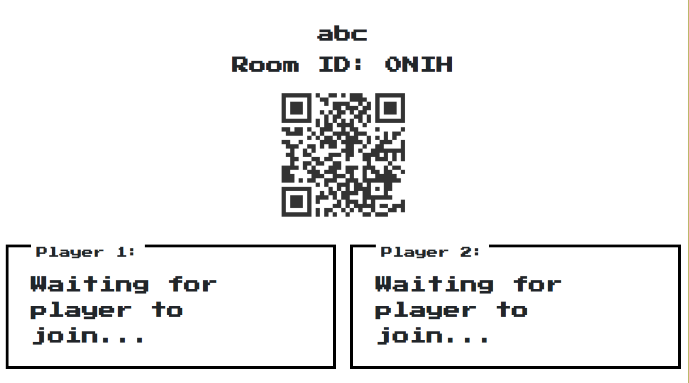

## Player Join Room
All players need to login before being able to join a room. After login, players can specify their nickname and join a room by entering the Room ID or scan QR code. 
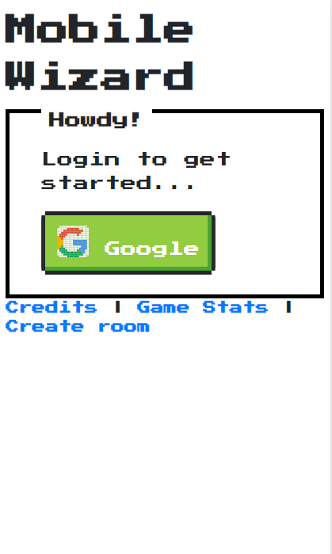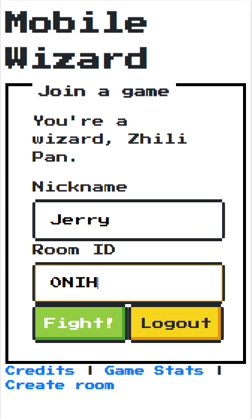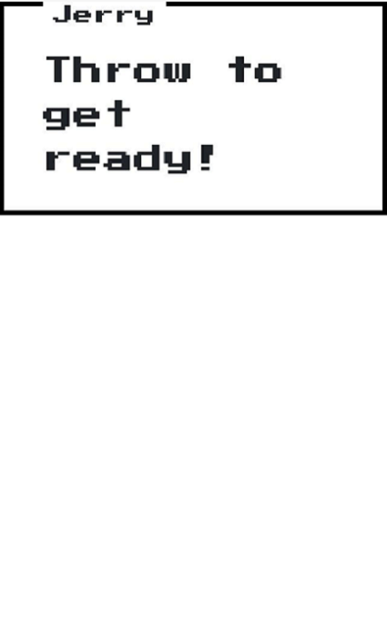
After joining successfully, players need to follow the instructions, press the corresponding button or perform corresponding actions (details in "Game Start" section) to get ready. Once both players are ready, a "Start Game" button will be shown in the host screen. Players then can press the button to start the game. 
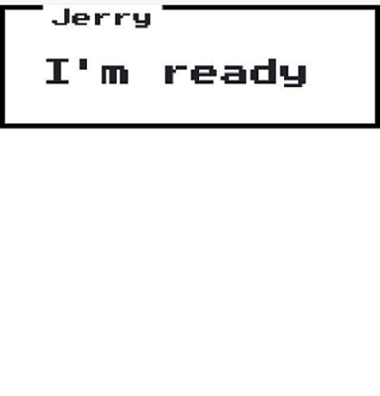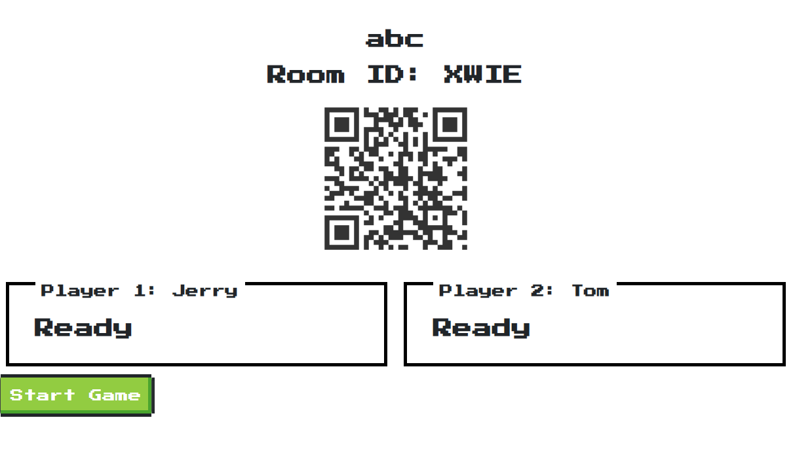

## Game Start
After game starts, the host screen will display health bars and animations for 2 players to reflect game status. At beginning, each player will have 100 HP.

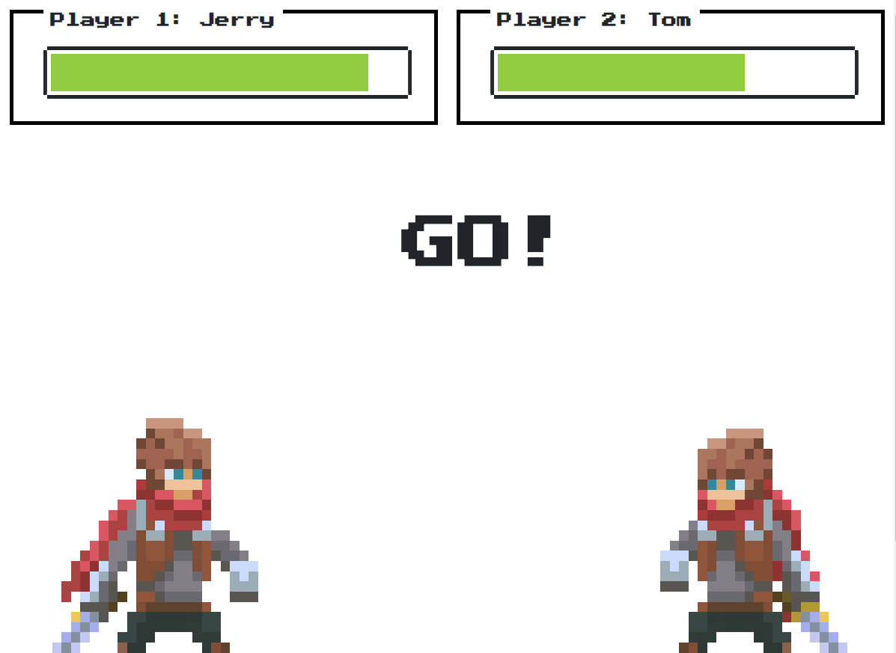

During the game, players can perform 3 kinds of actions by waving their mobile (wand):  

| Action | Info | Gesture |
| --- | --- | --- |
| Throw | Damage 5 | [Video Guide](https://youtu.be/HAow_74arEc) |
| Strike | Damage 10 | [Video Guide](https://youtu.be/kJKHnjNadyo) |
| Defense | Can block Throws in next 2s, can block Strikes in next 1s | [Video Guide](https://youtu.be/azHLuAq9Suk) |

Game will end once one player's health is less than or equal to 0.

## After Game
After game ends, the host screen will display the game statistics for both players as following. By pressing the "End Game" button, players will be directed back to home page to create new rooms.

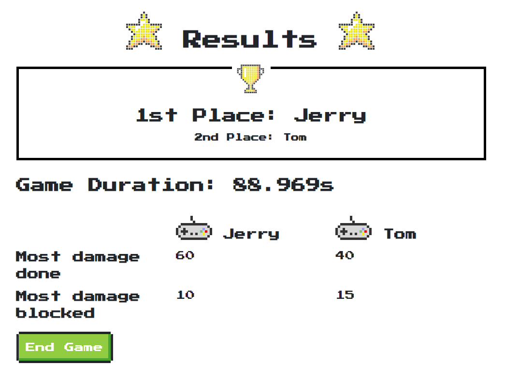

Players will also be able to see their own game statistics on their mobiles after game ends. Players can also view the overall performance of themselves in all past games by pressing the "My stats" button. If players want to start a new game, they can press the "New Game" or "Join room" buttons to join a new room.

  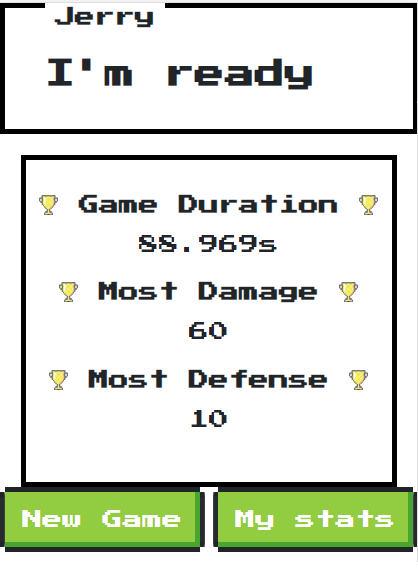
  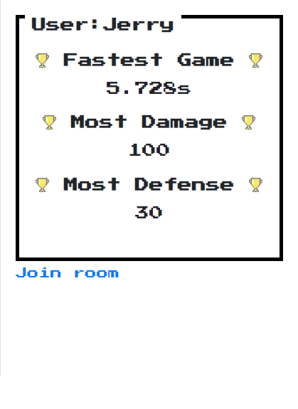

